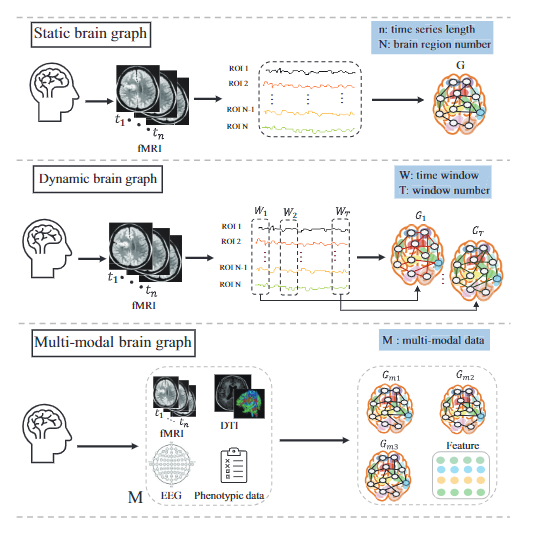

# Awesome-Brain-Graph-Learning-with-GNNs

 
 

 

:fire::fire: This is a collection of awesome papers about graph neural networks for brain graph learning

## Contents
- [Surveys](#surveys)
- [Prediction-Based Static Brain Graph Learning](#Prediction-Based-Static-Brain-Graph-Learning)
- [Pathogenic-Based Static Brain Graph Learning](#Pathogenic-Based-Static-Brain-Graph-Learning)
- [Prediction-Based Dynamic Brain Graph Learning](#Prediction-Based-Dynamic-Brain-Graph-Learning)
- [Pathogenic-Based Dynamic Brain Graph Learning](#Pathogenic-Based-Dynamic-Brain-Graph-Learning)
- [Prediction-Based Multi-Modal Brain Graph Learning](#Prediction-Based-Multi-Modal-Brain-Graph-Learning)
- [Pathogenic-Based Multi-Modal Brain Graph Learning](#Pathogenic-Based-Multi-Modal-Brain-Graph-Learning)
- [Brain Datasets](#Brain-Datasets)
- [Brain Graph Analysis Tools](#Brain-Graph-Analysis-Tools)

----------
## The framework of brain graph learning based on GNNs

## Surveys

| **Paper Title** | **Venue** | **Year** | **Code** |
| --------------- | ---- | -- | -- |
| [Benchmarking Graph Neural Networks for FMRI analysis](https://arxiv.org/pdf/2211.08927.pdf) | _Arxiv_ | 2022 |[[Code]](https://github.com/elgazzarr/fMRI-GNNs) |
| [Graph neural networks for image‐guided disease diagnosis: A review](https://onlinelibrary.wiley.com/doi/pdfdirect/10.1002/ird3.20) | _iRADIOLOGY_ | 2023 |-|
| [NeuroGraph: Benchmarks for Graph Machine Learning in Brain Connectomics](https://arxiv.org/pdf/2306.06202.pdf) | _Arxiv_ | 2023 | [[Code]](https://anwar-said.github.io/anwarsaid/neurograph.html) |
| [GNN4EEG: A Benchmark and Toolkit for Electroencephalography Classification with Graph Neural Network](https://arxiv.org/pdf/2309.15515.pdf) | _Arxiv_ | 2023 | [[Code]](https://github.com/Miracle-2001/GNN4EEG)|
| [A Survey of EEG Analysis based on Graph Neural Network](https://ieeexplore.ieee.org/stamp/stamp.jsp?arnumber=9742089) |_CECIT Conference_ | 2021 |-|
| [BrainGB: A Benchmark for Brain Network Analysis With Graph Neural Networks](https://ieeexplore.ieee.org/stamp/stamp.jsp?arnumber=9933896) |_IEEE TMI_ | 2022 |[[Code]](https://github.com/HennyJie/BrainGB)|
| [Graph Neural Networks and Their Current Applications in Bioinformatics](https://www.ncbi.nlm.nih.gov/pmc/articles/PMC8360394/) |_Frontiers in genetics_ | 2021 |-|
| [Graph Neural Networks in Network Neuroscience](https://ieeexplore.ieee.org/stamp/stamp.jsp?arnumber=9903566) |_IEEE TPAMI_ | 2022 |-|

----------
## The toy example of different types of brain graph generated
[]

## Prediction-Based Static Brain Graph Learning

| **Paper Title** | **Venue** | **Year** | **Model** | **Code** |
| ------ | :----: | :--: | :----: | :----: |
| [EEG-Based Graph Neural Network Classification of Alzheimer’s Disease: An Empirical Evaluation of Functional Connectivity Methods](https://ieeexplore.ieee.org/stamp/stamp.jsp?arnumber=9878348) | _IEEE TNSRE_ | 2022 | - | - |
| [Effective and Interpretable fMRI Analysis via Functional Brain Network Generation ](https://arxiv.org/pdf/2107.11247.pdf) | _ICML Workshop_ | 2021 | - | - |
| [ Multi-Level Graph Neural Network With Sparsity Pooling for Recognizing Parkinson’s Disease ](https://ieeexplore.ieee.org/stamp/stamp.jsp?arnumber=10310009) | _IEEE TNSRE_ | 2023 | SparsityATopK | - |
| [Balanced Graph Structure Information for Brain Disease Detection ](https://arxiv.org/pdf/2401.00876.pdf) | _PKAW_ | 2023 | Bargrain |- |
| [Brain network classification based on dynamic graph attention information bottleneck]( https://www.sciencedirect.com/science/article/pii/S0169260723005795) | _Comput. Meth. Programs Biomed._ | 2024 |  | - |

 
